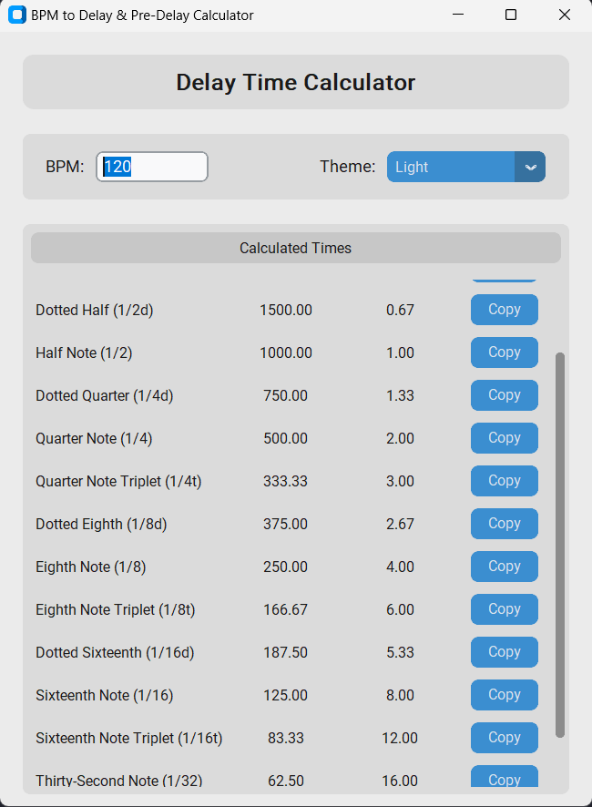

# BPM to Delay & Pre-Delay Calculator


A modern, cross-platform desktop GUI application built with Python and CustomTkinter to calculate musical delay and pre-delay times (in milliseconds and Hertz) from a given BPM. This tool is designed for music producers, audio engineers, and sound designers who need to quickly sync their effects to their project's tempo.

Here's the calculator in action, showing both dark and light themes.




## Features

-   **Modern UI:** Clean, minimalist interface with built-in support for **Light** and **Dark** themes.
-   **Real-time Calculations:** Delay times update instantly as you type the BPM.
-   **Comprehensive Note Values:** Includes a full range of note durations, including standard, **dotted**, and **triplet** values.
-   **Frequency Sync:** In addition to delay time in milliseconds (ms), it calculates the corresponding frequency (Hz), perfect for syncing LFOs on synthesizers and effects.
-   **One-Click Copy:** A convenient "Copy" button for each value allows you to paste the result directly into your DAW (Digital Audio Workstation) or plugin.
-   **Cross-Platform:** Built with Python and Tkinter, it runs on Windows, macOS, and Linux.

## Why This Tool?

In modern music production, syncing time-based effects like delay and reverb to the project's tempo is crucial for a tight, professional sound. While some DAWs have this built-in, many plugins (especially older or analog-modeled ones) require you to enter delay times manually in milliseconds. This calculator removes the guesswork and tedious math, providing a fast and accurate workflow.

## Installation & Usage

### Prerequisites

-   Python 3.8 or newer.

### 1. Clone the Repository

```bash
git clone https://github.com/your-username/your-repository-name.git
cd your-repository-name
```

### 2. Set Up a Virtual Environment (Recommended)

-   **On macOS/Linux:**
    ```bash
    python3 -m venv venv
    source venv/bin/activate
    ```
-   **On Windows:**
    ```bash
    python -m venv venv
    .\venv\Scripts\activate
    ```

### 3. Install Dependencies

This project uses the `customtkinter` library. Install it using pip:

```bash
pip install customtkinter
```

### 4. Run the Application

Once the dependencies are installed, run the script:

```bash
python delay_calculator.py
```

## How to Use the Calculator

1.  **Enter BPM:** Type your project's Beats Per Minute into the "BPM" entry box.
2.  **View Results:** The table will instantly update with the calculated times.
    -   **Delay (ms):** Use this value for your delay effect's time or your reverb's pre-delay.
    -   **Frequency (Hz):** Use this value for syncing LFO rates on effects like tremolo, auto-pan, or synth filters.
3.  **Copy Value:** Click the "Copy" button next to the desired millisecond value. The value is now on your clipboard, ready to be pasted.
4.  **Change Theme:** Use the dropdown menu at the top right to switch between "Dark", "Light", and "System" appearance modes.

## Technology Stack

-   **Language:** Python
-   **GUI Framework:** [CustomTkinter](https://github.com/TomSchimansky/CustomTkinter) (built on top of Tkinter)

## License

This project is licensed under the MIT License. See the `LICENSE` file for details.

## Contributing

Pull requests are welcome. For major changes, please open an issue first to discuss what you would like to change.
